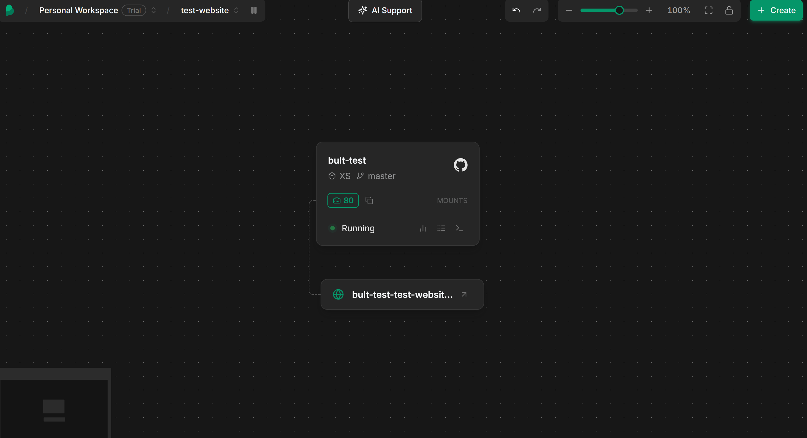
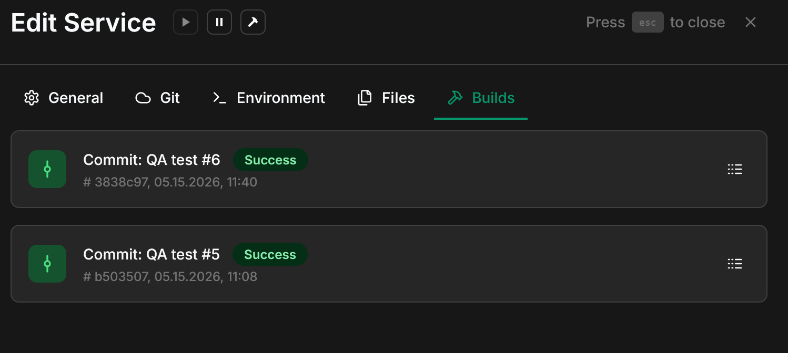
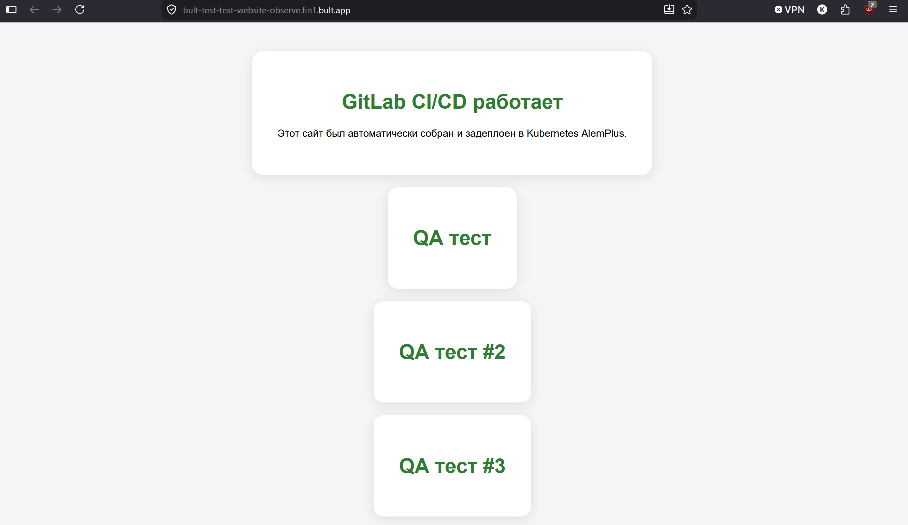

# QA Отчет – Тестирование Deployment Functionality платформы Bult.ai

## Цель тестирования

Целью данного тестирования являлась проверка функционала деплоя веб-приложения через платформу Bult.ai, включая процесс подключения репозитория, сборку Docker-контейнера, развертывание приложения и обновление сервиса после изменений в репозитории.

---

# Тестовое окружение

| Компонент | Описание |
|---|---|
| Операционная система | Windows 11 |
| Платформа деплоя | Bult.ai |
| Система контроля версий | Git |
| Репозиторий | GitHub |
| Контейнеризация | Docker |
| Веб-сервер | Nginx |
| Тип приложения | Static Website |

---

# Архитектура deployment

Для деплоя приложения использовался GitHub repository, подключенный к Bult.ai dashboard.  
Первоначально проект находился в GitLab repository, однако для использования Bult.ai потребовалось создание отдельного GitHub repository и загрузка проекта в него.

Для корректного deployment использовался `Dockerfile`.

Файл `.gitlab-ci.yml` не использовался платформой Bult.ai, так как CI/CD pipeline GitLab относится исключительно к GitLab deployment workflow и не применяется при deployment через Bult.ai.

---

# Протестированный функционал

| ID Теста | Функционал | Ожидаемый результат | Фактический результат | Статус |
|---|---|---|---|---|
| QA-01 | Подключение GitHub repository | Репозиторий успешно подключается к Bult.ai | Подключение выполнено успешно | ✅ |
| QA-02 | Docker build | Docker image успешно собирается | Build выполнен успешно | ✅ |
| QA-03 | Deployment веб-сайта | Сервис успешно разворачивается | Deployment выполнен успешно | ✅ |
| QA-04 | Доступность deployed website | Сайт открывается по route URL | Сайт доступен и функционирует корректно | ✅ |
| QA-05 | Отображение HTML/CSS | Веб-сайт отображается корректно | Интерфейс отображается без ошибок | ✅ |
| QA-06 | Обновление deployment после изменений | Сервис автоматически обновляется после push | Требуется manual rebuild | ⚠ |

---

# Проверка deployment functionality

Во время тестирования были проверены следующие функции платформы:

- Подключение GitHub repository
- Build Docker image
- Deployment контейнера
- Создание route URL
- Доступность deployed service
- Отображение веб-приложения
- Обновление deployment после изменений в repository

---

# Обнаруженные проблемы и ограничения

| Проблема | Описание | Severity |
|---|---|---|
| Недостаточная документация | Инструкции по deployment и route creation отсутствуют | Medium |
| Отсутствие объяснения route creation | На Alem Plus отсутствует объяснение создания ссылки на deployed service | Medium |
| Отсутствие auto-redeployment | После обновления GitHub repository сервис не обновляется автоматически | Medium |
| Необходимость использования GitHub | Для deployment потребовалось создание отдельного GitHub repository | Low |
| Недостаточная детализация build pipelines | Build pipelines в Bult.ai уступает GitLab по читабельности, информативности и уровню детализации логов | Medium |

---

# Сравнение с GitLab CI/CD

Во время тестирования было проведено сравнение deployment workflow Bult.ai и GitLab CI/CD.

## Преимущества GitLab CI/CD

- Возможность напрямую использовать GitLab repository
- Полноценный auto-redeployment после push
- Более подробная документация
- Полностью автоматизированный pipeline
- Интеграция CI/CD внутри одной платформы

## Недостатки Bult.ai по сравнению с GitLab

- Отсутствие automatic redeployment
- Необходимость manual rebuild после обновлений
- Необходимость создания отдельного GitHub repository
- Недостаточно подробная документация deployment workflow
- Отсутствие объяснения route creation

---

# Скриншоты
- Dashboard Bult.ai

- Успешный deployment

- Deployed website

---

# Заключение

В ходе тестирования deployment functionality платформы Bult.ai было установлено, что сервис способен успешно выполнять Docker-based deployment веб-приложений и корректно отображать deployed services.

Платформа успешно выполняет build и deployment контейнеров, однако процесс deployment уступает GitLab CI/CD по уровню автоматизации и удобству использования. Основными недостатками являются отсутствие automatic redeployment, необходимость manual rebuild после обновлений repository, а также недостаточно подробная документация по deployment workflow и route creation. Bult.ai предоставляет менее детализированную информацию о процессе build и deployment. Build pipeline GitLab предоставляет более подробные и удобные для анализа логи и обеспечивает лучшую читаемость этапов pipeline

Несмотря на указанные ограничения, базовый deployment functionality платформы работает стабильно и позволяет успешно размещать веб-приложения.
