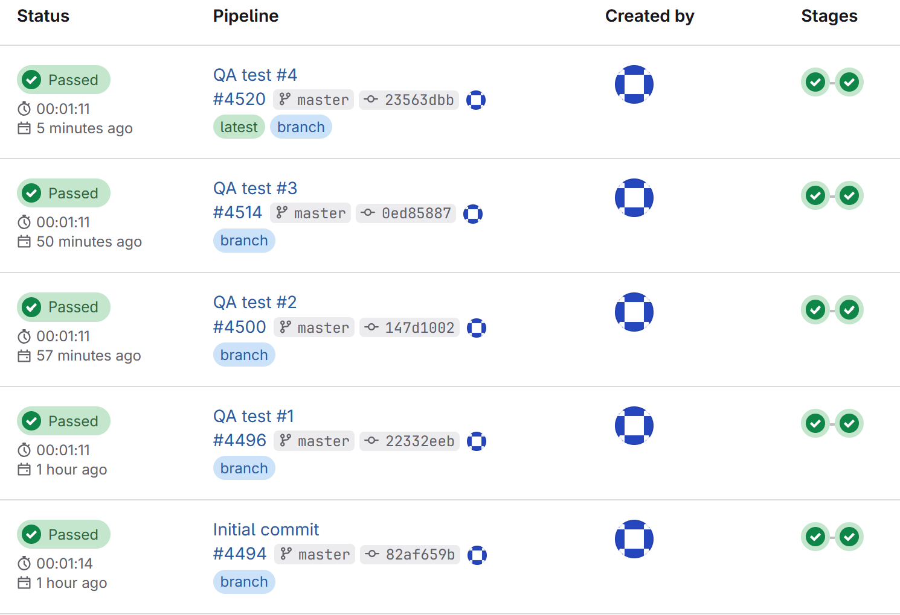
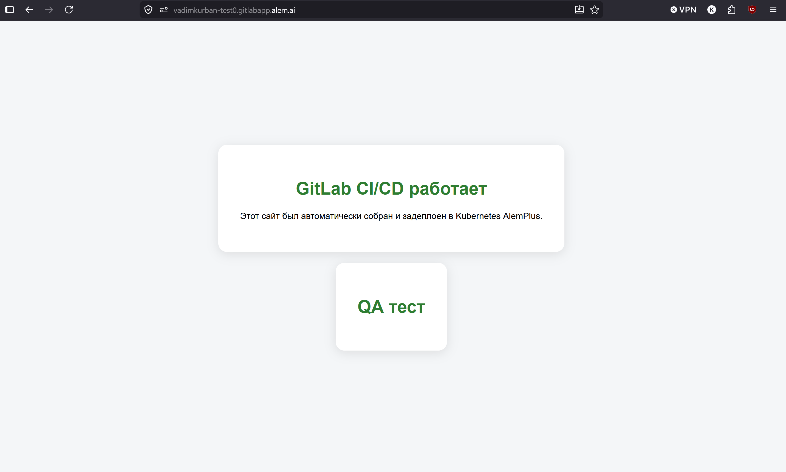
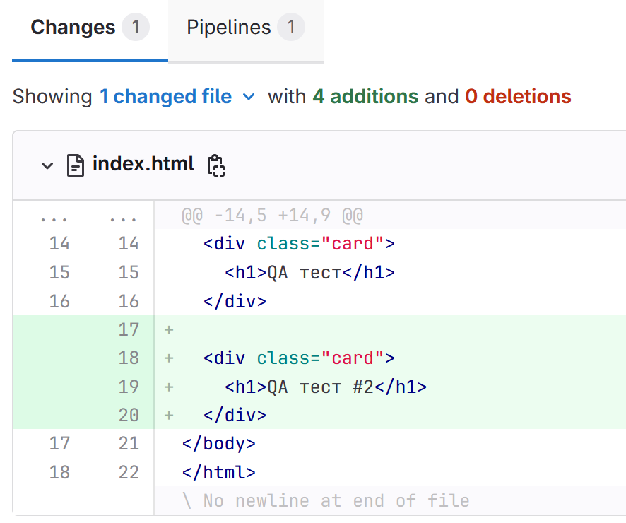
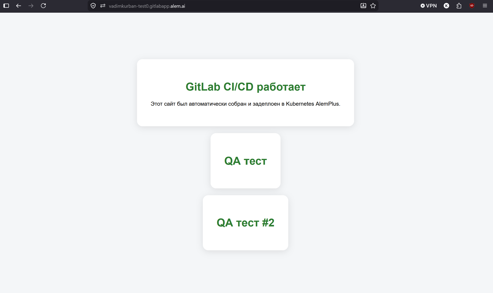

# QA Отчет – GitLab CI/CD и Kubernetes Deployment

## Цель

Цель данного тестирования заключалась в проверке корректной работы GitLab CI/CD pipeline, автоматической сборки Docker-контейнера, деплоя приложения в Kubernetes кластер AlemPlus, а также автоматического обновления приложения после внесения изменений в код.

---

## Тестовое окружение

| Компонент | Описание |
|---|---|
| Операционная система | Windows 11 |
| Система контроля версий | Git |
| CI/CD платформа | GitLab |
| Контейнеризация | Docker |
| Платформа деплоя | Kubernetes AlemPlus |
| Веб-сервер | Nginx |
| Используемая ветка | master |

---

## Ссылка на веб-сайт

[Открыть веб-сайт](https://vadimkurban-test0.gitlabapp.alem.ai/)

---

## Протестированный функционал

| ID Теста | Функционал | Ожидаемый результат | Фактический результат | Статус |
|---|---|---|---|---|
| QA-01 | Инициализация Git репозитория | Репозиторий успешно инициализируется | Репозиторий успешно создан | ✅ Пройден |
| QA-02 | Push кода в GitLab | Код успешно загружается в удаленный репозиторий | Push выполнен успешно | ✅ Пройден |
| QA-03 | Автоматический запуск pipeline | Pipeline автоматически запускается после push | Pipeline успешно запустился | ✅ Пройден |
| QA-04 | Сборка Docker образа | Docker образ успешно собирается | Сборка выполнена успешно | ✅ Пройден |
| QA-05 | Деплой в Kubernetes | Приложение успешно деплоится в кластер | Deployment выполнен успешно | ✅ Пройден |
| QA-06 | Доступность веб-сайта | Сайт открывается в браузере | Сайт успешно доступен по URL | ✅ Пройден |
| QA-07 | Отображение CSS | Стили отображаются корректно | CSS отображается корректно | ✅ Пройден |
| QA-08 | Автоматический redeploy | После нового push приложение автоматически обновляется | Redeploy выполнен успешно | ✅ Пройден |

---

## Обнаруженные проблемы

| Проблема | Решение |
|---|---|
| Команда Git не распознавалась в CMD | Git был установлен и добавлен в PATH |
| Ошибка SSH-аутентификации | Использован HTTPS remote URL вместо SSH |
| Pipeline не запускался в ветке main | Ветка была изменена на master в соответствии с настройками CI/CD |

---

## Скриншоты

- Успешное выполнение GitLab pipeline

- Успешно задеплоенный веб-сайт

- Автоматическое обновление сайта после нового commit

---

## Заключение

GitLab CI/CD pipeline был успешно настроен и протестирован. Сборка Docker-контейнера, автоматический деплой в Kubernetes кластер и автоматическое обновление приложения после изменений в коде функционируют корректно. Развернутый веб-сайт успешно доступен и корректно отображается в браузере.
